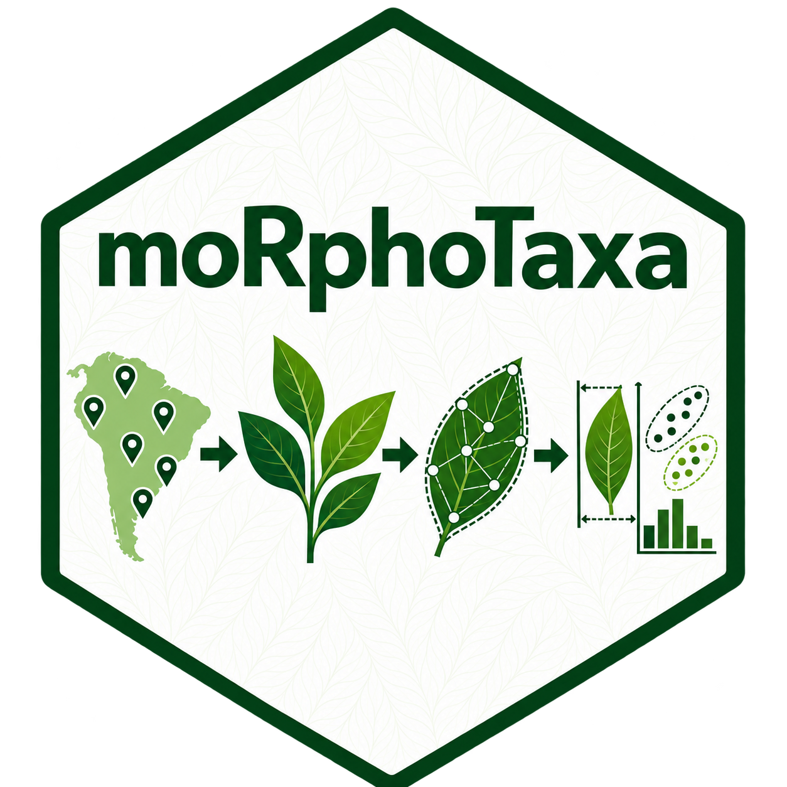
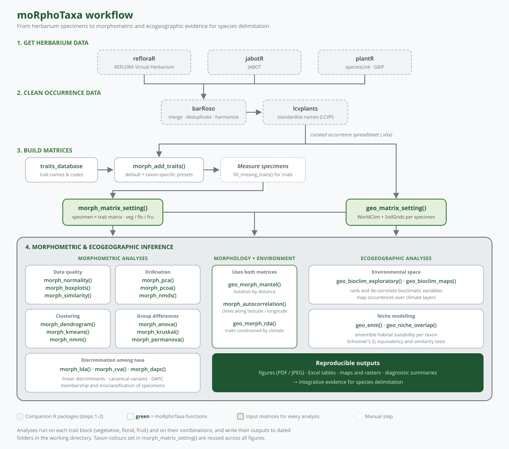

<!-- README.md is generated from README.Rmd. Please edit that file -->

```{r, include = FALSE}
knitr::opts_chunk$set(
  collapse = TRUE,
  comment = "#>",
  fig.path = "figures/",
  out.width = "100%"
)
```

# moRphoTaxa 

<!-- badges: start -->
[](https://app.codecov.io/gh/DBOSlab/moRphoTaxa)
[](https://github.com/DBOSlab/moRphoTaxa/actions/workflows/test-coverage.yaml)
[](https://github.com/DBOSlab/moRphoTaxa/actions/workflows/R-CMD-check.yaml)
[](LICENSE)
<!-- badges: end -->

`moRphoTaxa` is an R package for standardized morphometric and
ecogeographic analysis of plant groups. It builds analysis-ready
morphological trait matrices — from a curated set of default and
taxon-specific trait presets — and ecogeographic matrices combining
WorldClim bioclimatic and SoilGrids edaphic variables, then provides a
full suite of documented functions for data-quality checks, ordination,
clustering, confirmatory statistics, and environmental/niche analysis
on those matrices. It is designed to support integrative morphometric
taxonomy, from trait compilation through to statistically supported
morphogroup and niche-differentiation inference.


## Workflow



The complete, step-by-step pipeline, including herbarium data retrieval and occurrence cleaning with companion packages, is documented on the
[moRphoTaxa website](https://dboslab.github.io/moRphoTaxa-website/).


## Key features

- 🧬 **Standardized trait matrices** — default angiosperm traits plus taxon-specific presets
- 🌎 **Ecogeographic matrices** — automated extraction of WorldClim bioclimatic variables and, optionally, SoilGrids edaphic variables per occurrence record
- 📊 **Data quality & exploration** — normality testing, boxplots/violin plots, pairwise trait similarity
- 🧭 **Multivariate ordination** — PCA, PCoA, NMDS
- 🔗 **Clustering** — hierarchical dendrograms, k-means with gap-statistic selection of k, normal mixture models
- ✅ **Confirmatory statistics** — ANOVA, PERMANOVA, Kruskal–Wallis, LDA, CVA, DAPC
- 🗺️ **Bioclimatic exploration & mapping** — variable ranking/correlation screening and spatial mapping of bioclimatic layers
- 📐 **Geo–morphology integration** — Mantel tests, trait spatial autocorrelation, and RDA of traits constrained by bioclimatic variables
- 🌡️ **Niche analysis** — ecological niche modelling and pairwise niche-overlap tests
- 📁 **Reproducible outputs** — every analysis function can export plots (multiple formats) and, where applicable, Excel summary tables

Designed to standardize and expedite integrative morphometric analyses
for species complexes, taxonomic revisions, and comparative studies
across plant families.


## Installation

You can install the development version of `moRphoTaxa` from
[GitHub](https://github.com/DBOSlab/moRphoTaxa) with:

``` r
if (!requireNamespace("BiocManager", quietly = TRUE))
install.packages("BiocManager")

# Install the development version of moRphoTaxa from GitHub,
# together with its required dependencies
BiocManager::install("DBOSlab/moRphoTaxa", dependencies = TRUE)
```

``` r
library(moRphoTaxa)
```

## Usage

The package's functions are organized into the groups below: trait-matrix
construction, matrix setup, data quality & exploration, ordination,
clustering, confirmatory statistics, and ecogeographic/niche analysis.


#### *1. `morph_add_traits`: Building a standardized morphological trait matrix*

Creates a data frame of qualitative and quantitative morphological
trait columns, optionally appended to an existing specimen-occurrence
data frame. Traits can be labeled by full name, abbreviated code, or
both, and can combine a default angiosperm-wide trait set with
taxon-specific presets.

``` r
library(moRphoTaxa)

df_morph_traits <- morph_add_traits(
  base_df = NULL,
  trait_name = "both",
  quali_default = TRUE,
  quanti_default = TRUE,
  quali_specific = "papilionoideae",
  quanti_specific = "papilionoideae",
  save = TRUE,
  file_name = "output_data/trait_data.xlsx",
  verbose = TRUE
)
```

When a non-angiosperm preset (`"bryophyta"`, `"lycopodiopsida"`,
`"pinophyta"`, or `"polypodiopsida"`) is requested, the angiosperm-wide default traits are automatically
excluded, since they do not apply to those lineages.

The bundled `traits_database` data frame documents every trait
currently implemented — full name, abbreviated code, trait type
(qualitative/quantitative), and the preset it belongs to — and can be
inspected before building a matrix:

``` r
data(traits_database)
unique(traits_database$trait_scope)
subset(traits_database, trait_scope == "passifloraceae")
```

#### *2. `morph_matrix_setting`: Setting up the morphometric matrix*

Reads a curated specimen dataset and builds the standardized
morphometric matrix used by every downstream `morph_*()` function.
Specimens are identified by the taxon/ID column set in `taxon_col`,
and the dataset can be restricted to a subset of taxa via
`species_selected` (a character vector of taxon names to keep; `NULL`
keeps every taxon present in `xlsx_path`). The function then splits
traits into vegetative, floral, and fruit blocks and assigns a
consistent color per taxon for all later plots.

``` r
morphmatrix <- morph_matrix_setting(
  xlsx_path = "output_data/all_data.xlsx",
  taxon_col = "taxon",
  species_selected = NULL,
  trait_name_type = "code",
  veg_first = "petiole_length/PETIlng",
  flo_first = "inflorescence_length/INFLlng",
  fru_first = "fruit_stipe_length/FRSTlng",
  colors = NULL
)
```

`colors` accepts a user-supplied named vector of per-taxon colors; if
`NULL`, a palette is generated automatically and stored as a
`taxon_colors` attribute, reused by every plotting function in the
package.

#### *3. `geo_matrix_setting`: Setting up the ecogeographic matrix*

Builds the ecogeographic counterpart of `morph_matrix_setting()`:
retrieves WorldClim bioclimatic variables for each occurrence record
and, optionally, SoilGrids edaphic variables at a given depth.

``` r
geomatrix <- geo_matrix_setting(
  xlsx_path = "output_data/all_data.xlsx",
  sheet = 1,
  taxon_col = "taxon",
  species_selected = NULL,
  wc_res = 2.5,
  edaphic = TRUE,
  edaphic_vars = c("clay", "sand", "silt", "soc", "phh2o", "cec",
                   "nitrogen", "bdod", "cfvo", "ocd", "ocs"),
  edaphic_depth = 5,
  data_path = "variables_data/",
  verbose = TRUE
)
```

#### *4. Data quality & exploration*

`morph_normality()` tests each quantitative trait for normality per
block and can produce Q-Q plots; `morph_boxplots()` draws boxplots or
violin plots of each trait by taxon; `morph_similarity()` screens
pairwise trait-to-trait correlations within each block, flagging
significant associations after multiple-testing correction.

``` r
morph_normality(analysis_data = morphmatrix, norm_alpha = 0.05,
                norm_qq = TRUE, file_formats = "jpeg", verbose = TRUE)

morph_boxplots(analysis_data = morphmatrix, plot_type = "violin",
               show_jitter = TRUE, min_n_total = 10,
               file_formats = "jpeg", verbose = TRUE)

morph_similarity(analysis_data = morphmatrix, sim_blocks = "all",
                 sim_method = "pearson", sim_p_adjust = "BH",
                 sim_alpha = 0.05, sim_min_n = 5, file_formats = "jpeg")
```

#### *5. Ordination: `morph_pca`, `morph_pcoa`, `morph_nmds`*

Three complementary ordination methods on the morphometric matrix:
PCA for quantitative traits, PCoA on a dissimilarity matrix (Gower by
default, with a negative-eigenvalue correction option), and NMDS as a
rank-based alternative.

``` r
morph_pca(analysis_data = morphmatrix, pca_blocks = "all",
          top_contrib = 10, file_formats = "jpeg", verbose = TRUE)

morph_pcoa(analysis_data = morphmatrix, pcoa_blocks = "all",
           dist_method = "gower", correction = "lingoes",
           top_vars = 10, file_formats = "jpeg", verbose = TRUE)

morph_nmds(analysis_data = morphmatrix, nmds_blocks = "all",
           nmds_dist = "gower", nmds_k = 2, nmds_trymax = 100,
           nmds_seed = 42, file_formats = "jpeg", verbose = TRUE)
```

#### *6. Clustering: `morph_dendrogram`, `morph_kmeans`, `morph_nmm`*

Hierarchical clustering with automatic choice of linkage method and
number of clusters, k-means partitioning on PCA axes with the number of
clusters chosen by the gap statistic, and normal mixture-model clustering (`mclust`) with
confidence ellipses.

``` r
morph_dendrogram(analysis_data = morphmatrix, dendro_blocks = "all",
                 dist_method = "bray", linkage_candidates = "complete",
                 k_max = 8, file_formats = c("pdf", "jpeg"), verbose = TRUE)

morph_kmeans(analysis_data = morphmatrix, kmeans_blocks = "all",
             kmeans_k_max = 10, kmeans_B = 50, kmeans_nstart = 25,
             kmeans_pcs = c("PC1", "PC2"), kmeans_seed = 123,
             file_formats = "jpeg", verbose = TRUE)

morph_nmm(analysis_data = morphmatrix, nmm_blocks = "all",
          nmm_top_traits = 10, nmm_min_n = 10, ellipse_level = 0.4,
          nmm_seed = 123, save_xlsx = TRUE, file_formats = "jpeg",
          verbose = TRUE)
```

#### *7. Confirmatory statistics: `morph_anova`, `morph_permanova`, `morph_kruskal`, `morph_lda`, `morph_cva`, `morph_dapc`*

Six functions for testing and visualizing group differences: one-way
ANOVA and its non-parametric counterpart (Kruskal–Wallis, with
optional Dunn's post-hoc), PERMANOVA on a dissimilarity matrix, and
three discriminant/canonical methods (LDA, CVA, DAPC), each plotted
with confidence ellipses.

``` r
morph_anova(analysis_data = morphmatrix, anova_blocks = "all",
            anova_groups = "taxon", anova_p_adjust = "BH",
            anova_alpha = 0.05, save_xlsx = TRUE, file_formats = "jpeg",
            verbose = TRUE)

morph_permanova(analysis_data = morphmatrix, permanova_blocks = "all",
                dist_method = "gower", permutations = 999, min_n = 3,
                p_adjust = "BH", ellipse_level = 0.95, seed = 123,
                save_xlsx = TRUE, file_formats = "jpeg", verbose = TRUE)

morph_kruskal(analysis_data = morphmatrix, kw_blocks = "all",
              kw_groups = "taxon", kw_p_adjust = "BH", kw_alpha = 0.05,
              kw_posthoc = TRUE, save_xlsx = TRUE, file_formats = "jpeg",
              verbose = TRUE)

morph_lda(analysis_data = morphmatrix, lda_blocks = "all",
          lda_group = "taxon", lda_lds = c("LD1", "LD2"),
          lda_ellipse = 0.95, lda_min_n = 3, lda_impute = "mean",
          save_xlsx = TRUE, file_formats = "jpeg", verbose = TRUE)

morph_cva(analysis_data = morphmatrix, cva_blocks = "all",
          cva_ellipse = 0.95, cva_min_n = 3,
          file_formats = c("pdf", "jpeg"), verbose = TRUE)

morph_dapc(analysis_data = morphmatrix, dapc_blocks = "all",
           dapc_min_n = 3, dapc_ellipse = 0.95, file_formats = "jpeg",
           verbose = TRUE)
```

#### *8. Bioclimatic exploration & mapping: `geo_bioclim_exploratory`, `geo_bioclim_maps`*

`geo_bioclim_exploratory()` ranks the 19 bioclimatic variables by
variance and pairwise correlation and summarizes them with a PCA,
exporting the ranking to Excel; `geo_bioclim_maps()` maps a chosen
bioclimatic layer across the study area together with occurrence
points.

``` r
geo_bioclim_exploratory(geodata = geomatrix, bio_x = 15, bio_y = 12,
                        cor_threshold = 0.8, file_formats = "jpg",
                        verbose = TRUE)

geo_bioclim_maps(geodata = geomatrix, bio_map_layer = 12, bio_x = 1,
                 bio_y = 12, show_country_states = NULL,
                 show_rivers = FALSE, river_scale = 10, inset = TRUE,
                 pt_shapes = NULL, save = TRUE, file_formats = "jpg",
                 verbose = TRUE)
```

#### *9. Geo–morphology integration: `geo_morph_mantel`, `morph_autocorrelation`, `geo_morph_rda`*

`geo_morph_mantel()` tests whether morphological distance correlates
with geographic distance; `morph_autocorrelation()` tests each trait
for lag-1 spatial autocorrelation along a chosen specimen ordering
(latitude, longitude, or original order); `geo_morph_rda()` runs a
Redundancy Analysis of morphological traits constrained by
bioclimatic variables, per trait block, after dropping redundant
environmental predictors.

``` r
geo_morph_mantel(geodata = geomatrix, analysis_data = morphmatrix,
                 cor_method = "pearson", permutations = 999,
                 dist_method = "gower", geo_dist_method = "euclidean",
                 file_formats = "jpg", verbose = TRUE)

morph_autocorrelation(analysis_data = morphmatrix, geodata = geomatrix,
                      blocks = "all", cor_method = "pearson",
                      order_by = "latitude", file_formats = "jpg",
                      verbose = TRUE)

geo_morph_rda(analysis_data = morphmatrix, geodata = geomatrix,
              blocks = "all", env_vars = NULL, permutations = 999,
              scale_data = TRUE, env_cor_threshold = 0.95,
              file_formats = "jpg", verbose = TRUE)
```

#### *10. Niche analysis: `geo_enm`, `geo_niche_overlap`*

`geo_enm()` fits an ecological niche model per taxon (background
sampling within a spatial buffer, cross-validated, with
permutation-based variable importance); `geo_niche_overlap()`
quantifies pairwise niche overlap in environmental space with a
randomization-based significance test.

``` r
geo_enm(geodata = geomatrix, buffer_km = 100, pa_ratio = 2, folds = 5,
        min_occ = 3, importance_perm = 10, seed = 123,
        show_country_states = NULL, inset = TRUE, save = TRUE,
        file_formats = "jpg", verbose = TRUE)

geo_niche_overlap(geodata = geomatrix, var_threshold = 0.95,
                  cor_cutoff = 0.8, grid_size = 100, iterations = 1000,
                  alpha = 0.05, min_occ = 3, n_cores = 1, seed = 123,
                  save = TRUE, file_formats = "jpg", verbose = TRUE)
```


## Complete workflow example

A full analysis, from a trait template to niche overlap:

``` r
library(moRphoTaxa)

# Step 1: Build a trait matrix template for a target group
df_morph_traits <- morph_add_traits(
  quali_specific = "papilionoideae",
  quanti_specific = "papilionoideae",
  save = TRUE,
  file_name = "output_data/trait_data.xlsx"
)

# Step 2: (after manual trait scoring) set up the morphometric matrix
morphmatrix <- morph_matrix_setting(
  xlsx_path = "output_data/all_data.xlsx",
  taxon_col = "taxon",
  trait_name_type = "code",
  veg_first = "petiole_length/PETIlng",
  flo_first = "inflorescence_length/INFLlng",
  fru_first = "fruit_stipe_length/FRSTlng"
)

# Step 3: data quality, ordination, clustering, confirmatory statistics
morph_normality(analysis_data = morphmatrix)
morph_pca(analysis_data = morphmatrix)
morph_kmeans(analysis_data = morphmatrix)
morph_permanova(analysis_data = morphmatrix)

# Step 4: set up the ecogeographic matrix
geomatrix <- geo_matrix_setting(
  xlsx_path = "output_data/all_data.xlsx",
  taxon_col = "taxon",
  edaphic = TRUE
)

# Step 5: bioclimatic screening, geo-morphology integration, and niche analysis
geo_bioclim_exploratory(geodata = geomatrix)
geo_morph_rda(analysis_data = morphmatrix, geodata = geomatrix)
geo_enm(geodata = geomatrix)
geo_niche_overlap(geodata = geomatrix)
```


## Input data requirements

`morph_matrix_setting()` and `geo_matrix_setting()` both read from an
Excel file (`xlsx_path`) with one row per specimen/occurrence record.
At minimum this file must include:

| Column | Used by | Description |
|---|---|---|
| Taxon column (name set via `taxon_col`) | both | Grouping variable used across every analysis function |
| Morphological trait columns | `morph_matrix_setting()` | As generated by `morph_add_traits()`, labeled per `trait_name_type` (`"code"`, full name, or both) |
| Vegetative/floral/fruit boundary columns | `morph_matrix_setting()` | Identified via `veg_first`, `flo_first`, `fru_first` to split traits into blocks |
| Geographic coordinates (`decimalLatitude` and `decimalLongitude`) | `geo_matrix_setting()` | Used to extract WorldClim/SoilGrids values and to compute geographic distances |


## Output formats

Across the package, `file_formats` controls which image format(s) each
plotting function saves: `morph_*()` functions accept `"pdf"` and/or
`"jpeg"`, while `geo_*()` functions and `morph_autocorrelation()` accept
`"pdf"` and/or `"jpg"` (e.g. `c("pdf", "jpg")`). `save_xlsx` (where
available) additionally exports the underlying numeric results to an
Excel workbook.


## Documentation

Full function documentation is available at the `moRphoTaxa`
[website](https://dboslab.github.io/moRphoTaxa-website/).


## License

License information is available in the package's `LICENSE` file on
[GitHub](https://github.com/DBOSlab/moRphoTaxa).


## Authors

- **João Dornelas** — MSc student in plant systematics, ENBT/JBRJ.
  Responsible for designing and coding functions as well as developing
  the project website.  
  Email: joaovitordornelas@hotmail.com · 
  ORCID: [0009-0007-3416-9321](https://orcid.org/0009-0007-3416-9321) ·
  Lattes: [link](https://lattes.cnpq.br/9822787278995098)

- **Andressa Novaes** — PhD student in plant systematics, ENBT/JBRJ.
  Responsible for designing and coding functions.  
  Email: adrovlim@gmail.com · 
  ORCID: [0009-0003-6735-0718](https://orcid.org/0009-0003-6735-0718) ·
  Lattes: [link](https://lattes.cnpq.br/2917283771553844)

- **Valner Jordão** — PhD student in plant systematics, ENBT/JBRJ.
  Responsible for designing and coding functions.  
  Email: valner.jordao@gmail.com · 
  ORCID: [0000-0002-6328-0738](https://orcid.org/0000-0002-6328-0738) ·
  Lattes: [link](https://lattes.cnpq.br/5405013641413074)

- **Domingos Cardoso** — Taxonomist and bioinformatician. Responsible
  for designing and coding functions as well as developing the
  project website.  
  Email: domingoscardoso@jbrj.gov.br · 
  ORCID: [0000-0001-7072-2656](https://orcid.org/0000-0001-7072-2656) ·
  Lattes: [link](http://lattes.cnpq.br/2228981567893077)


## Acknowledgments

The package uses environmental data from:

- [WorldClim](https://www.worldclim.org/)
- [SoilGrids](https://soilgrids.org/)


## Contributing

Contributions are welcome! Please feel free to submit issues and pull
requests on the GitHub repository.
