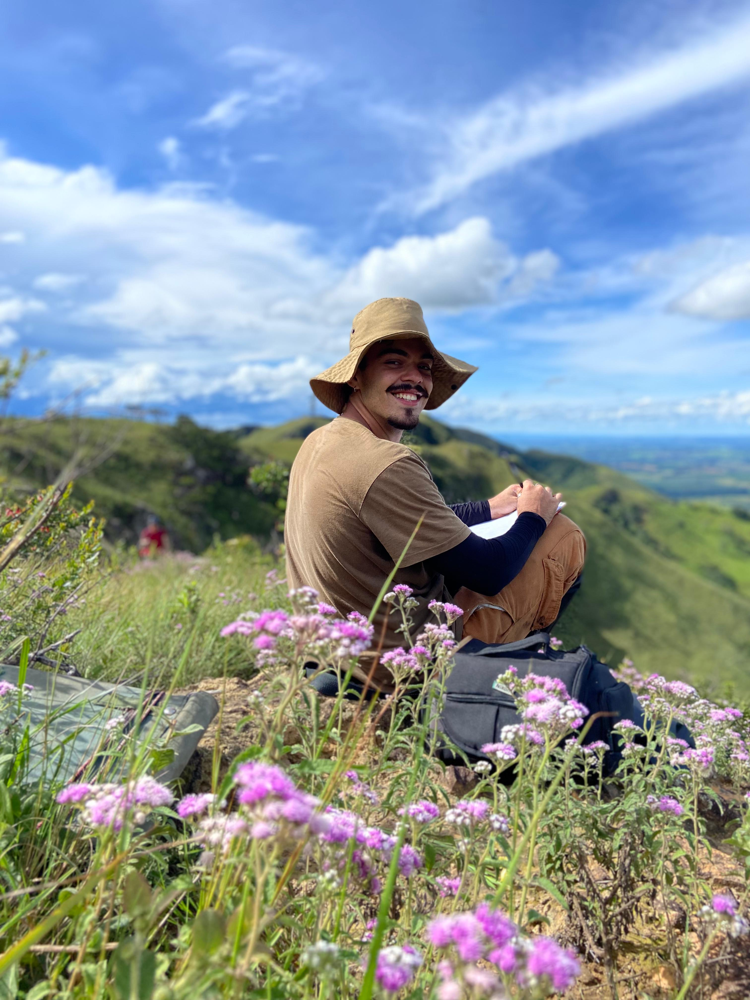
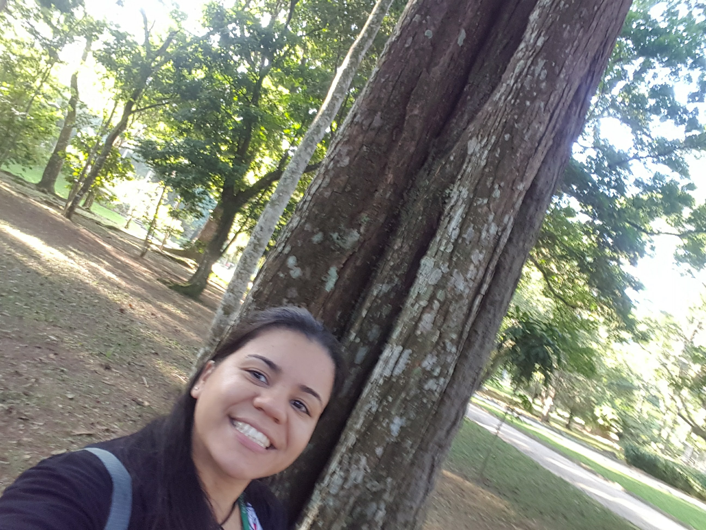
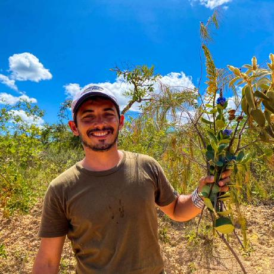

<style>
  .icon-link {
    display: inline-block;
    margin: 0 6px;
  }

  .icon-link img {
    width: 18px;
    height: 18px;
    vertical-align: text-bottom;
  }
</style>

## The moRphoTaxa Pipeline Developers

```{=html}
<div class="authors-group">
  
  <div class="author-card">
    
    <div class="author-info">
      <h3 class="author-name">João Dornelas</h3>
      <p>
        <a class="icon-link" href="mailto:joaovitordornelas@hotmail.com"></a>
        <a class="icon-link" href="https://orcid.org/0009-0007-3416-9321" target="_blank"></a>
        <a class="icon-link" href="https://lattes.cnpq.br/9822787278995098" target="_blank"></a>
      </p>
      <p>MSc student in plant systematics at ENBT/JBRJ, responsible for designing and coding functions as well as developing the project website</p>
    </div>
  </div>
  
    <div class="author-card">
    
    <div class="author-info">
      <h3 class="author-name">Andressa Novaes</h3>
      <p>
        <a class="icon-link" href="mailto:adrovlim@gmail.com"></a>
        <a class="icon-link" href="https://orcid.org/0009-0003-6735-0718" target="_blank"></a>
        <a class="icon-link" href="https://lattes.cnpq.br/2917283771553844" target="_blank"></a>
      </p>
      <p>PhD student in plant systematics at ENBT/JBRJ, responsible for designing and coding functions</p>
    </div>
  </div>
  
    <div class="author-card">
    
    <div class="author-info">
      <h3 class="author-name">Valner Jordão</h3>
      <p>
        <a class="icon-link" href="mailto:valner.jordao@gmail.com"></a>
        <a class="icon-link" href="https://orcid.org/0000-0002-6328-0738" target="_blank"></a>
        <a class="icon-link" href="https://lattes.cnpq.br/5405013641413074" target="_blank"></a>
      </p>
      <p>PhD student in plant systematics at ENBT/JBRJ, responsible for designing and coding functions</p>
    </div>
  </div>
  
    <div class="author-card">
    
    <div class="author-info">
      <h3 class="author-name">Domingos Cardoso</h3>
      <p>
        <a class="icon-link" href="mailto:domingoscardoso@jbrj.gov.br"></a>
        <a class="icon-link" href="https://orcid.org/0000-0001-7072-2656" target="_blank"></a>
        <a class="icon-link" href="http://lattes.cnpq.br/2228981567893077" target="_blank"></a>
      </p>
      <p>Taxonomist and bioinformatician, responsible for designing and coding functions as well as developing the project website</p>
    </div>
  </div>
  
</div>
```


<style>
.authors-group {
  display: flex;
  flex-wrap: wrap;
  justify-content: center;
  gap: 24px;
  margin-bottom: 2rem;
}

.author-card {
  background: #f8f9fa;
  border-radius: 12px;
  box-shadow: 0 0 10px rgba(0,0,0,0.1);
  padding: 1rem;
  width: 300px;
  transition: transform 0.3s ease;
}

.author-card:hover {
  transform: scale(1.05);
  z-index: 2;
}

.author-photo {
  width: 100%;
  height: 260px;
  object-fit: cover;
  border-radius: 10px;
  margin-bottom: 1rem;
}

.author-info {
  text-align: center;
}

.author-info p a {
  margin: 0 6px;
  color: #007bff;
  font-size: 1.1rem;
}

.author-name {
  margin-top: 0;
  margin-bottom: 0.5rem;
  text-align: center;
}
</style>


